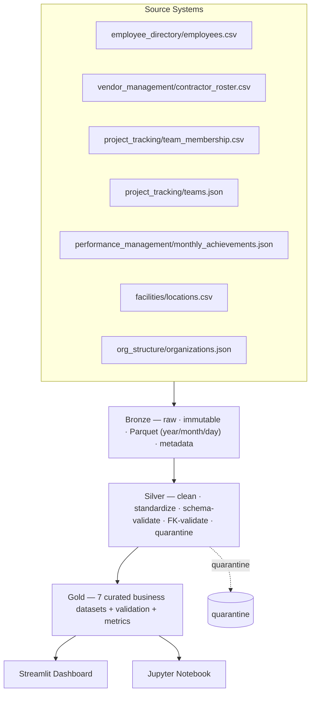

# ARCHITECTURE

## Medallion data lake

## Layer responsibilities

| Layer | Mutates data? | Purpose | Storage |
|-------|:-------------:|---------|---------|
| **Bronze** | ❌ never | Immutable source of truth; provenance metadata | `lakehouse/bronze/<ds>/year=/month=/day=/data.parquet` |
| **Silver** | ✅ deterministic | Clean, standardize, validate, quarantine | `lakehouse/silver/<ds>/…/data.parquet` |
| **Gold** | ✅ aggregate | Exactly 7 business datasets | `lakehouse/gold/<ds>/…/data.parquet` |
| **Analytics** | ❌ read-only | Dashboard + notebook (Gold-only) | — |

## Cross-cutting design

- **Config** — `etl/common/config.py` (pydantic-settings); nothing hardcoded.
  Source registry in `config/sources.json` drives Bronze.
- **Logging** — `etl/common/logging.py` (Loguru), structured with
  `stage/batch_id/dataset` context; rotating file sink under `logs/`.
- **Metadata & observability** — `etl/common/metadata.py`
  (`IngestionMetadata`, `StageMetrics`, `PipelineExecution`), execution history
  ledger, per-stage metrics.
- **Reliability** — per-dataset isolation (continue-on-failure), retry with
  exponential backoff (`utils.retry`), idempotent partition overwrite.
- **Quality** — Pandera schemas, relationship validation, quarantine,
  quality-score metrics vs configurable thresholds.

## Principles

Idempotent · modular · configurable · recoverable · observable · testable ·
cloud-ready (path abstraction lets Bronze/Silver/Gold move to S3/ADLS/GCS).

## Design decisions

Recorded in [ASSUMPTIONS.md](ASSUMPTIONS.md); requirement mapping in
[REQUIREMENTS_TRACEABILITY.md](REQUIREMENTS_TRACEABILITY.md).
