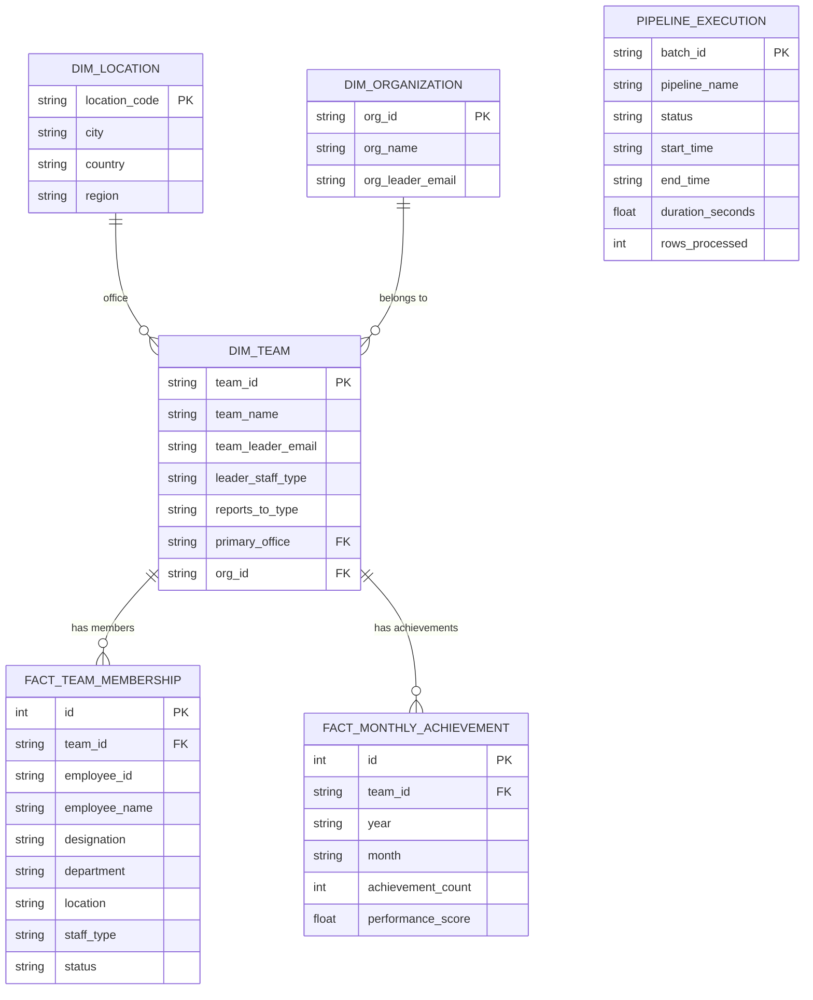

# ENTITY–RELATIONSHIP DIAGRAM

Serving-layer schema (PostgreSQL, `db/models/models.py`). The Parquet Gold layer
is the system of record; this relational model is the optional SQL-serving copy.

## Constraints

- **PKs:** every table above.
- **FKs:** `dim_team.primary_office → dim_location`, `dim_team.org_id →
  dim_organization`, `fact_*.team_id → dim_team` (all indexed).
- **NOT NULL:** dimension names, fact grain columns.
- **CHECK:** `leader_staff_type ∈ {direct, non_direct, unresolved}`,
  `staff_type ∈ {direct, non_direct, unknown}`, `achievement_count ≥ 0`.

## Migrations

Managed by Alembic (`alembic.ini`, `db/migrations/`). Apply with
`alembic upgrade head`; load Gold with `python scripts/load_gold_to_postgres.py`.
