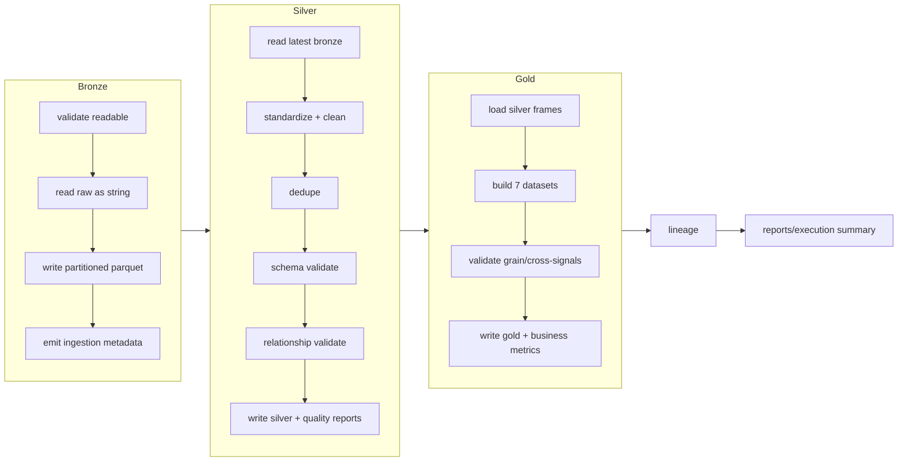

# ETL FLOW

## Execution order

## Commands

| Goal | Command |
|------|---------|
| Full pipeline | `python run_pipeline.py all` |
| Bronze only | `python run_pipeline.py bronze` |
| Silver only | `python run_pipeline.py silver` |
| Gold only | `python run_pipeline.py gold` |
| Lineage only | `python run_pipeline.py lineage` |

## Guarantees per stage

- **Idempotent** — partition overwrite + deterministic sorts; re-run → identical output.
- **Recoverable** — per-dataset try/except; one failure does not abort the batch.
- **Observable** — `StageMetrics` per dataset, structured logs, execution history.
- **Traceable** — every rejected row quarantined with reason; full lineage emitted.

## Error handling

Malformed/missing files, unreadable schemas and DB blips are caught per dataset;
transient failures retry with exponential backoff (`etl/common/utils.retry`).
Fatal configuration errors stop early with a clear message.
